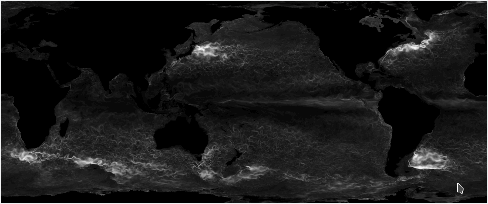

## EnKF-C ##

**EnKF-C** provides a compact generic framework for off-line data assimilation (DA) into large-scale layered geophysical models with the ensemble Kalman filter (EnKF).
Following are its other main features:

- coded in C for GNU/Linux platform;

- model-agnostic;

- can conduct DA either in EnKF or ensemble optimal interpolation (EnOI) mode;

- permits multiple model grids;

- can handle rectangular or curvilinear horizontal grids, z or sigma vertical layers.

For more information see [README](https://github.com/sakov/enkf-c/blob/master/enkf/README) and [user guide](https://github.com/sakov/enkf-c/blob/master/enkf/doc/enkf-userguide.pdf). (An older version of the user guide is also available from [arXiv](http://arxiv.org/abs/1410.1233).) Have a feel for how the code works by running the included example.

Checkout **EnKF-C** by running `git clone https://github.com/sakov/enkf-c`
or `svn checkout https://github.com/sakov/enkf-c`.

