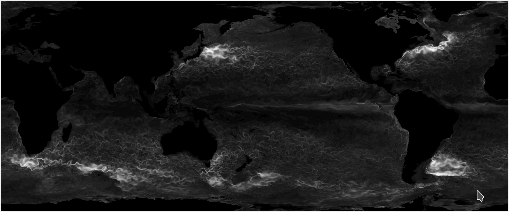

# EnKF-C (Ensemble Kalman Filter in C)

**EnKF-C** provides a compact generic framework for off-line data assimilation (DA) into large-scale layered geophysical models with the ensemble Kalman filter (EnKF).

Following are its other main features:
* Coded in C for GNU/Linux platform;
* Model-agnostic;
* Can conduct DA in EnKF, ensemble optimal interpolation (EnOI), or hybrid EnKF/EnOI modes;
* Permits multiple model grids;
* Can handle rectangular, curvilinear, or unstructured horizontal grids, z, sigma or hybrid vertical grids.

**EnKF-C** is coded for simplicity, scalability and robustness. To handle as large systems as possible it uses shared memory capabilities of MPI-3. Here is a snapshot of ensemble spread of sea surface temperature from the 96-member EnKF ocean forecasting system with MOM5 based OFAM3 model (51 x 1500 x 3600 grid), assimilating about 14M super-observations at each 3-day cycle.

For technical details, including dependencies, compilation steps, and runtime troubleshooting, please refer to [enkf/README](https://github.com). 

Detailed documentation is available in the [user guide](https://github.com) (an older version of the user guide is also available from [arXiv](http://arxiv.org)). Have a feel for how the code works by running the included examples.

Checkout **EnKF-C** by running `git clone https://github.com`.

***

## Reference
Sakov, P., 2014: *EnKF-C user guide*. Technical Report, Bureau of Meteorology. Available online from the [EnKF-C arXiv Paper Repository](https://arxiv.org).
